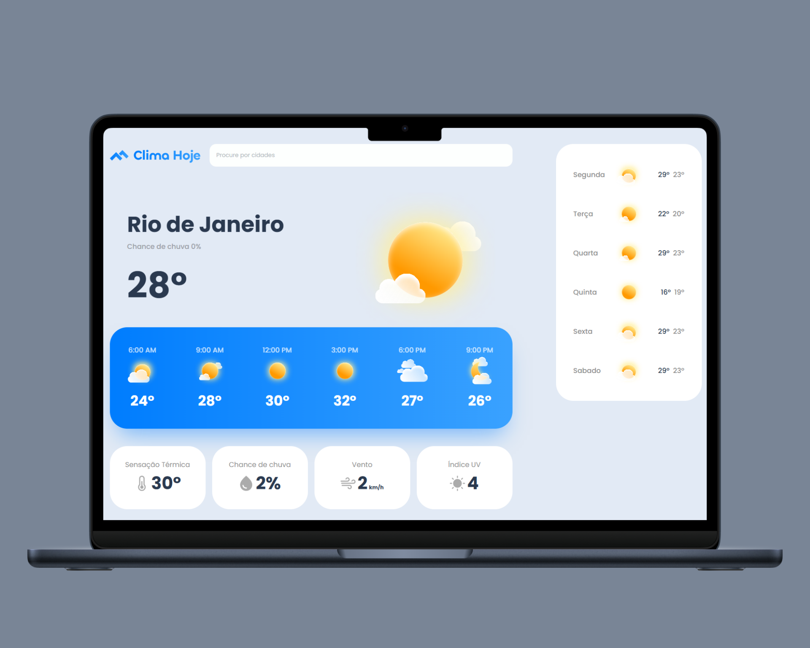
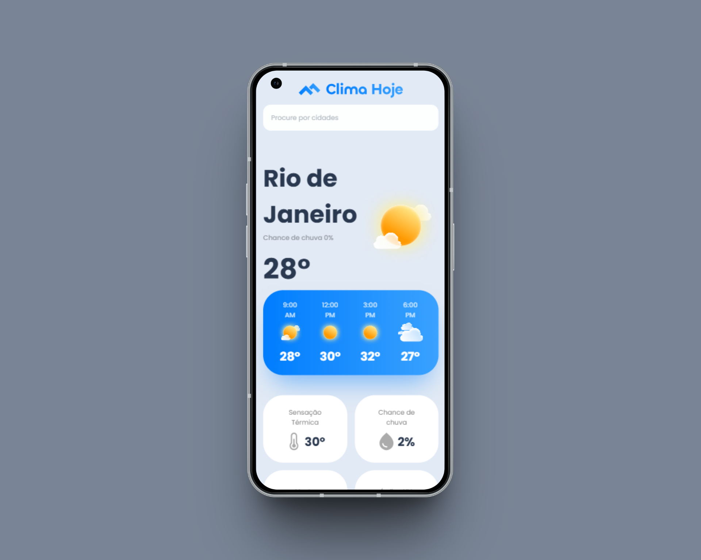

# 🌤️ Clima Hoje

Este é um projeto simples de previsão do tempo feito com **HTML** e **CSS**, com foco em **responsividade**, adaptando-se perfeitamente a dispositivos **desktop** e **mobile**.

## 💡 Sobre o Projeto

O **Clima Hoje** é uma interface fictícia de aplicativo de previsão do tempo que exibe:

- Localidade atual (Rio de Janeiro)
- Temperatura atual
- Previsão por horário
- Sensação térmica
- Chance de chuva
- Velocidade do vento
- Índice UV
- Previsão para os próximos dias

O layout foi cuidadosamente desenvolvido para funcionar bem tanto em telas maiores quanto em dispositivos móveis.

---

## 🖥️ Versão Desktop



---

## 📱 Versão Mobile



---

## 🛠️ Tecnologias Utilizadas

- HTML5
- CSS3
- Media Queries para responsividade
- Layout inspirado em aplicações modernas de clima

---

## 🎯 Objetivo do Projeto

Este projeto foi criado com fins de **estudo e prática de responsividade** usando apenas HTML e CSS. Ele simula uma interface funcional e moderna de um app de clima, sem integração com APIs externas, sendo totalmente estático.

---

## 📂 Como visualizar

1. Clone o repositório:
   ```bash
   git clone https://github.com/seu-usuario/nome-do-repositorio.git
   ```
